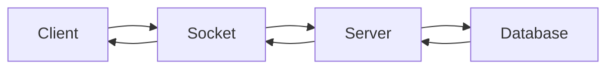

<h2 style= "text-align: center; color: red; font-weight : normal; padding: 0;"> Mô hình về cách thiết kế chương trình web client </h2>
<div align="center">


</div>

<div align="center">

```java

                                                    Nhận dữ liệu nhập từ bàn phím
                                                                    | 
                                                                    |   [ Phân loại dựa vào số lượng tham số ]
                                                                    V
                                [Single Connection] 1   <----------------------->    >= 2  [Multiple Connection]
                                                    |                                   |
                                                    V                                   V
                                            handleConnection()     <------    handleMultipleConnection()
                                                    |                    |              |
                                                    V                    |              V
                                                Xử lý URL                |______ Tạo các thread
                                                    |                                  
                                    host, path, fileName/ folderName
                                                    |                                  
                                                    V                                 
                                      Tạo socket kết nối đến server
                                                    |                                  
                                                    V                                 
                                            handleRequest()     
                                                    |                                                
                                                    V    
                            ----------------------------------
                          |                                     |
                          V                                     V                         
                    Download file    <--               Download folder
                          |             |                       |
                          V             |                       V
                    Create request      |___________   Tải file index.html
                          |             |                       |
                          V             |                       V
                     Send request       |          Lấy danh sách file trong thư mục
                          |             |                       |
                          V             |_______________________|
                    Receive response
                          |
                          V
                      Tách header: 
            status code, content length ? chunked
                          |   [Nếu status code = 200]
                          V
Download ContentLength <-----> Download chunked
        |                                  |
        V                                  V
    Get Length                       Tách chunk size
trong header response 
        |                                  |
        V                                  V
Vừa nhận vừa ghi file                Vừa nhận dữ liệu và ghi file
đến khi length = 0                   đến khi tách chunk size = 0
        |                                  |
        V                                  V
    ------------- Đóng socket ----------------


```


